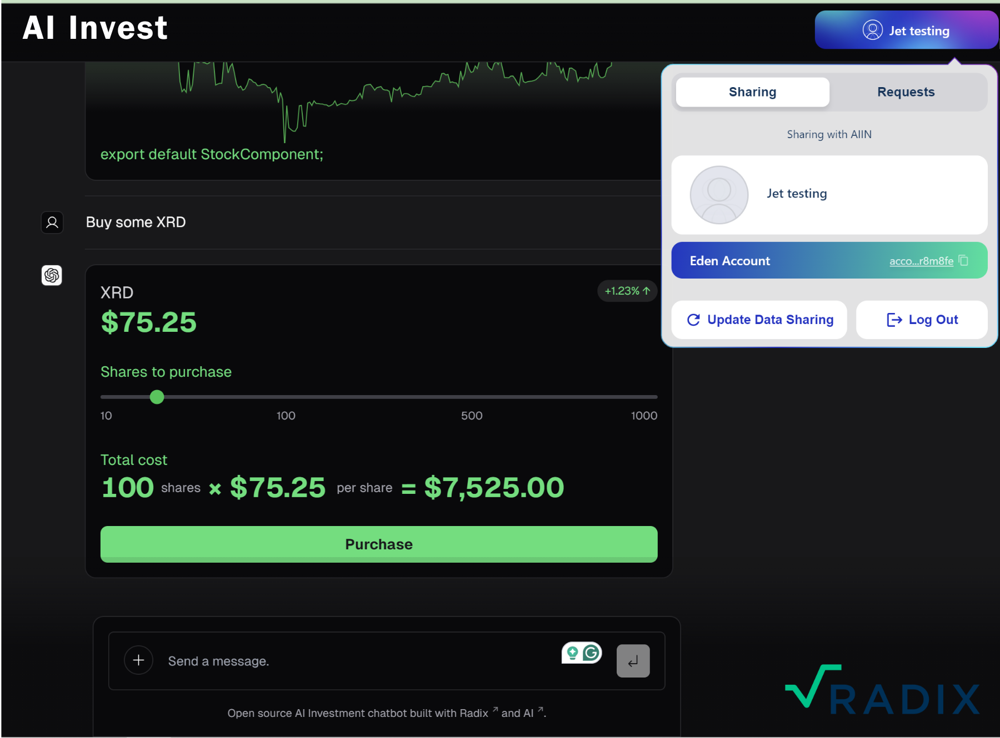

# AI Invest AI Chatbot for Stock Trading

 

**Tagline:** Revolutionizing Stock Trading with Conversational AI

## Problem Statement

**Issue:** The complexity and inaccessibility of stock trading for the average person.

**Impact:** Potential investors often feel overwhelmed and excluded from the stock market.

## Solution

**AI Invest AI Chatbot:** An AI-driven chatbot that simplifies stock trading through natural conversations.

**Features:**
- Real-time stock information
- Guidance on stock purchases
- Interactive UI elements for an engaging user experience

## Technology Overview

**Model Providers** Aiin ships with OpenAI `gpt-3.5-turbo` as the default. However, thanks to the [Vercel AI SDK](https://sdk.vercel.ai/docs), you can switch LLM providers to [Anthropic](https://anthropic.com), [Cohere](https://cohere.com/), [Hugging Face](https://huggingface.co), or using [LangChain](https://js.langchain.com) with just a few lines of code.

**Built With:** Advanced AI models, React for streamable UI components, and server-side logic for secure transactions.

**Integration:** Seamlessly integrates with MetaMask for transactions on the EVM Sidechain.

## Key Features

- **Stock Information:** Provides up-to-date stock prices and trends.
- **Purchase Facilitation:** Guides users through the process of buying stocks.
- **User Engagement:** Interactive elements like stock cards, purchase UIs, and event highlights.

## Target Audience

- **Novice Traders:** Individuals new to stock trading looking for a simplified entry point.
- **Tech-Savvy Investors:** Users comfortable with digital platforms seeking efficient ways to trade.
- **AI Enthusiasts:** People interested in the latest AI technologies and their applications.

## Market Opportunity

- **Growth of Retail Trading:** Highlight the increasing participation of retail investors in the stock market.
- **AI Adoption:** Discuss the growing acceptance and use of AI in financial services.

## Competitive Advantage

- **Innovative Approach:** Combining AI chat technology with stock trading.
- **User Experience:** Simplifying stock trading into conversational interactions.
- **Technology:** Leveraging cutting-edge AI for real-time data processing and decision support.

## Business Model

**Monetization Strategies:** Subscription fees, transaction fees, or partnerships with trading platforms.

## Roadmap

- **Current Status:** Development phase, key features implemented.
- **Next Steps:** Beta testing, user feedback collection, additional feature development.
- **Future Vision:** Expanding to other financial services, personal finance management, and global markets.

